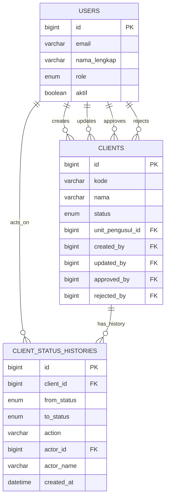

# Client State Machine Blueprint (GIN + GORM)

Dokumen ini adalah rencana implementasi konkret untuk modul Client dengan state machine dan audit trail.

## 1. Tujuan

- Menstandarkan lifecycle data Client: `DRAFT -> DIAJUKAN -> DISETUJUI/DITOLAK`.
- Menyediakan endpoint transisi status yang aman dan idempotent-friendly.
- Menjamin jejak audit lengkap pada setiap transisi.

## 2. Status dan Transisi

Status final:

- `DRAFT`
- `DIAJUKAN`
- `DISETUJUI`
- `DITOLAK`

Transisi yang diizinkan:

- `DRAFT -> DIAJUKAN` (submit)
- `DIAJUKAN -> DRAFT` (unsubmit)
- `DIAJUKAN -> DITOLAK` (reject)
- `DITOLAK -> DRAFT` (re-evaluate)

Transisi yang ditolak harus mengembalikan `409 Conflict`.

## 3. Kontrak API

Base path: `/api/v1`

Endpoint utama:

- `GET /clients`
- `POST /clients`
- `GET /clients/:id`
- `PUT /clients/:id`
- `DELETE /clients/:id`

Endpoint transisi:

- `POST /clients/:id/submit`
- `POST /clients/:id/unsubmit`
- `POST /clients/:id/reject`
- `POST /clients/:id/re-evaluate`

Endpoint riwayat:

- `GET /clients/:id/status-history`

Body request transisi:

- `submit`: optional `{ "note": "string" }`
- `unsubmit`: optional `{ "reason": "string" }`
- `reject`: required `{ "reason": "string" }`
- `re-evaluate`: optional `{ "reason": "string" }`

Konteks actor (`actor_id`, `role`, `full_name`) harus diambil dari JWT claim via middleware (`auth.user_id`, `auth.role`, `auth.full_name`), bukan dari body request.

Response sukses:

```json
{
  "success": true,
  "data": {
    "id": 123,
    "status": "DIAJUKAN"
  }
}
```

Response error:

```json
{
  "success": false,
  "error": "transition DRAFT -> DISETUJUI is not allowed"
}
```

## 4. Desain Tabel

### clients

- `id` bigint PK
- `kode` varchar(50) unique not null
- `nama` varchar(255) not null
- `status` enum('DRAFT','DIAJUKAN','DISETUJUI','DITOLAK') not null default 'DRAFT'
- `unit_pengusul_id` bigint null FK `unit_pengusul(id)`
- `created_by` bigint null FK `users(id)`
- `updated_by` bigint null FK `users(id)`
- `approved_by` bigint null FK `users(id)`
- `approved_at` datetime null
- `rejected_by` bigint null FK `users(id)`
- `rejected_at` datetime null
- `rejected_reason` text null
- `created_at` datetime not null
- `updated_at` datetime not null
- `deleted_at` datetime null

Index minimal:

- `idx_clients_status (status)`
- `idx_clients_unit_pengusul_id (unit_pengusul_id)`
- `idx_clients_deleted_at (deleted_at)`

### client_status_histories

- `id` bigint PK
- `client_id` bigint not null FK `clients(id)` on delete cascade
- `from_status` enum('DRAFT','DIAJUKAN','DISETUJUI','DITOLAK') null
- `to_status` enum('DRAFT','DIAJUKAN','DISETUJUI','DITOLAK') not null
- `action` varchar(32) not null
- `reason` text null
- `note` text null
- `actor_id` bigint null FK `users(id)`
- `actor_name` varchar(255) null
- `created_at` datetime not null

Index minimal:

- `idx_client_status_histories_client_id (client_id)`
- `idx_client_status_histories_created_at (created_at)`

### Relasi users, clients, dan client_status_histories

`users` adalah master actor untuk modul Client.

Relasi utamanya:

- `users.id -> clients.created_by`: user yang membuat data client.
- `users.id -> clients.updated_by`: user yang terakhir mengubah data client.
- `users.id -> clients.approved_by`: user yang menyetujui data client.
- `users.id -> clients.rejected_by`: user yang menolak data client.
- `users.id -> client_status_histories.actor_id`: user yang menjalankan action transisi.
- `clients.id -> client_status_histories.client_id`: satu client memiliki banyak histori status.

Implikasi desain:

- `clients` tidak menyimpan role actor, hanya menyimpan referensi `user_id` untuk peran create/update/approve/reject.
- `client_status_histories` menyimpan `actor_id` sebagai FK ke `users.id` dan `actor_name` sebagai snapshot nama saat aksi terjadi.
- `users.role` adalah sumber utama tunggal untuk role runtime saat login dan policy workflow.
- Jika role user berubah di Manajemen User, perubahan itu berlaku untuk aksi client berikutnya setelah sesi login/token diperbarui, tanpa mengubah histori client lama.

Skema relasi ringkas:

```text
users.id
  -> clients.created_by
  -> clients.updated_by
  -> clients.approved_by
  -> clients.rejected_by
  -> client_status_histories.actor_id

clients.id
  -> client_status_histories.client_id
```

Diagram ER ringkas:



## 5. Struktur File yang Direkomendasikan

Ikuti pola modul di project:

```text
internal/modules/client/
  delivery/http/
    handler.go
    dto.go
  usecase/
    service.go
    transition.go
  repository/
    gorm_repository.go
  domain/
    model.go
    status.go
```

File tambahan:

- `migrations/027_create_clients_and_status_histories.sql`
- Tambah registrasi route di bootstrap/router.
- Tambah ringkasan endpoint ke `docs/api-endpoints.md`.

## 6. Rule Role dan Otorisasi

Rule implementasi saat ini:

- `ADMIN`:
  - create/update/delete tanpa batas status ownership
  - boleh menjalankan semua action transisi (`submit`, `unsubmit`, `reject`, `re-evaluate`, `approve`)
- `OPERATOR` dan `PERENCANA`:
  - create/update/delete hanya untuk data milik sendiri (`created_by`) saat status `DRAFT`
  - boleh `submit` dan `unsubmit` untuk data milik sendiri
  - boleh `re-evaluate` hanya saat status data `DITOLAK` dan milik sendiri
- `VERIFIKATOR`:
  - boleh menjalankan `reject`
- `PIMPINAN`:
  - boleh menjalankan `approve`

Matriks ringkas:

| Action               | ADMIN | OPERATOR             | PERENCANA            | VERIFIKATOR | PIMPINAN |
| -------------------- | ----- | -------------------- | -------------------- | ----------- | -------- |
| create/update/delete | Ya    | Ya (owner + DRAFT)   | Ya (owner + DRAFT)   | Tidak       | Tidak    |
| submit               | Ya    | Ya (owner)           | Ya (owner)           | Tidak       | Tidak    |
| unsubmit             | Ya    | Ya (owner)           | Ya (owner)           | Tidak       | Tidak    |
| reject               | Ya    | Tidak                | Tidak                | Ya          | Tidak    |
| re-evaluate          | Ya    | Ya (owner + DITOLAK) | Ya (owner + DITOLAK) | Tidak       | Tidak    |
| approve              | Ya    | Tidak                | Tidak                | Tidak       | Ya       |

Aturan ini dipusatkan di policy usecase:

- `internal/modules/client/usecase/policy.go`

Status check tetap wajib dilakukan di usecase, bukan hanya di UI.

## 7. Pseudocode Service Transisi

```go
func (s *Service) Submit(ctx context.Context, actor AuthUser, id uint64, note string) error {
    return s.db.Transaction(func(tx *gorm.DB) error {
        c, err := s.repo.GetForUpdate(tx, id)
        if err != nil { return err }

        if c.Status != StatusDraft {
            return ErrInvalidTransition
        }
        if !s.policy.CanSubmit(actor, c) {
            return ErrForbidden
        }

        old := c.Status
        c.Status = StatusDiajukan
        c.UpdatedBy = actor.ID

        if err := s.repo.Update(tx, c); err != nil {
            return err
        }

        return s.historyRepo.Create(tx, ClientStatusHistory{
            ClientID:   c.ID,
            FromStatus: old,
            ToStatus:   c.Status,
            Action:     "submit",
            Note:       note,
            ActorID:    actor.ID,
            ActorName:  actor.Name,
        })
    })
}
```

## 8. Mapping Error HTTP

- `ErrUnauthorized` -> `401`
- `ErrForbidden` -> `403`
- `ErrNotFound` -> `404`
- `ErrInvalidTransition` -> `409`
- `ErrValidation` -> `400`
- default -> `500`

## 9. Checklist Implementasi

1. Tambah migration tabel `clients` dan `client_status_histories`.
2. Tambah domain enum status dan validator transisi.
3. Tambah repository method `GetForUpdate` dan `CreateHistory`.
4. Implement usecase transisi + transaction boundary.
5. Tambah handler endpoint CRUD + transisi + status history.
6. Daftarkan route di bootstrap.
7. Tambah test usecase transisi valid/invalid.
8. Tambah integration test untuk `403` dan `409`.

## 10. Query Monitoring yang Disarankan

Audit trail terbaru per client:

```sql
SELECT h.client_id, h.from_status, h.to_status, h.action, h.actor_name, h.created_at
FROM client_status_histories h
WHERE h.client_id = ?
ORDER BY h.created_at DESC
LIMIT 50;
```

Distribusi status client aktif:

```sql
SELECT status, COUNT(*) AS total
FROM clients
WHERE deleted_at IS NULL
GROUP BY status;
```
