# ERD - Performance Planning System

```mermaid
erDiagram
    UNIT_PENGUSUL ||--o{ USERS : has
    UNIT_PELAKSANA ||--o{ USERS : has

    VISI ||--o{ MISI : has
    MISI ||--o{ TUJUAN : has
    TUJUAN ||--o{ INDIKATOR_TUJUAN : has
    TUJUAN ||--o{ SASARAN : has
    SASARAN ||--o{ INDIKATOR_SASARAN : has

    UNIT_PENGUSUL ||--o{ PROGRAM : owns
    SASARAN ||--o{ PROGRAM : has
    PROGRAM ||--o{ INDIKATOR_PROGRAM : has

    UNIT_PELAKSANA ||--o{ KEGIATAN : executes
    PROGRAM ||--o{ KEGIATAN : has
    KEGIATAN ||--o{ INDIKATOR_KEGIATAN : has
    KEGIATAN ||--o{ SUB_KEGIATAN : has
    SUB_KEGIATAN ||--o{ INDIKATOR_SUB_KEGIATAN : has

    UNIT_PENGUSUL ||--o{ RENCANA_KERJA : submits
    USERS ||--o{ RENCANA_KERJA : creates
    USERS ||--o{ RENCANA_KERJA : approves
    INDIKATOR_SUB_KEGIATAN ||--o{ RENCANA_KERJA : linked

    RENCANA_KERJA ||--o{ INDIKATOR_RENCANA_KERJA : has
    INDIKATOR_RENCANA_KERJA ||--o{ REALISASI_RENCANA_KERJA : records
    USERS ||--o{ REALISASI_RENCANA_KERJA : inputs

    INDIKATOR_RENCANA_KERJA ||--o{ TARGET_DAN_REALISASI : tracks
    USERS ||--o{ TARGET_DAN_REALISASI : verifies

    UNIT_PENGUSUL {
      bigint id PK
      varchar kode UK
      varchar nama
      tinyint aktif
    }

    UNIT_PELAKSANA {
      bigint id PK
      varchar kode UK
      varchar nama
      tinyint aktif
    }

    USERS {
      bigint id PK
      bigint unit_pengusul_id FK
      bigint unit_pelaksana_id FK
      varchar email UK
      enum role
      tinyint aktif
    }

    VISI {
      bigint id PK
      varchar kode UK
      varchar nama
      smallint tahun_mulai
      smallint tahun_selesai
    }

    MISI {
      bigint id PK
      bigint visi_id FK
      varchar kode UK
      varchar nama
    }

    TUJUAN {
      bigint id PK
      bigint misi_id FK
      varchar kode UK
      varchar nama
    }

    INDIKATOR_TUJUAN {
      bigint id PK
      bigint tujuan_id FK
      varchar kode UK
      varchar nama
      decimal baseline
    }

    SASARAN {
      bigint id PK
      bigint tujuan_id FK
      varchar kode UK
      varchar nama
    }

    INDIKATOR_SASARAN {
      bigint id PK
      bigint sasaran_id FK
      varchar kode UK
      varchar nama
      decimal baseline
    }

    PROGRAM {
      bigint id PK
      bigint sasaran_id FK
      bigint unit_pengusul_id FK
      varchar kode UK
      varchar nama
    }

    INDIKATOR_PROGRAM {
      bigint id PK
      bigint program_id FK
      varchar kode UK
      varchar nama
      decimal baseline
    }

    KEGIATAN {
      bigint id PK
      bigint program_id FK
      bigint unit_pelaksana_id FK
      varchar kode UK
      varchar nama
    }

    INDIKATOR_KEGIATAN {
      bigint id PK
      bigint kegiatan_id FK
      varchar kode UK
      varchar nama
      decimal baseline
    }

    SUB_KEGIATAN {
      bigint id PK
      bigint kegiatan_id FK
      varchar kode UK
      varchar nama
    }

    INDIKATOR_SUB_KEGIATAN {
      bigint id PK
      bigint sub_kegiatan_id FK
      varchar kode UK
      varchar nama
      decimal baseline
    }

    RENCANA_KERJA {
      bigint id PK
      bigint indikator_sub_kegiatan_id FK
      bigint unit_pengusul_id FK
      bigint dibuat_oleh FK
      bigint disetujui_oleh FK
      varchar kode UK
      smallint tahun
      tinyint triwulan
      enum status
    }

    INDIKATOR_RENCANA_KERJA {
      bigint id PK
      bigint rencana_kerja_id FK
      varchar kode UK
      decimal target_tahunan
      decimal anggaran_tahunan
    }

    REALISASI_RENCANA_KERJA {
      bigint id PK
      bigint indikator_rencana_kerja_id FK
      bigint diinput_oleh FK
      smallint tahun
      tinyint bulan
      tinyint triwulan
      decimal nilai_realisasi
      decimal realisasi_anggaran
    }

    TARGET_DAN_REALISASI {
      bigint id PK
      bigint indikator_rencana_kerja_id FK
      bigint diverifikasi_oleh FK
      smallint tahun
      tinyint triwulan
      decimal target_nilai
      decimal realisasi_nilai
      decimal capaian_persen
      enum status
    }
```

## Notes

- `indikator_sub_kegiatan_id` is modeled as `NOT NULL` in `rencana_kerja` based on latest schema/migrations.
- `indikator_rencana_kerja` no longer contains `indikator_sub_kegiatan_id` (dropped in migration `013`).
- Cardinality uses crow's-foot notation in Mermaid (`||--o{`).
